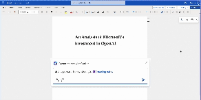

# Final Project for JRNL5500 - Coding for Digital Storytelling

Article covering Microsoft's integration of ChatGPT into Office Products.

Coded & Written Spring 2023, in the middle of my second concussion :)

Created interactive clones of Word and Outlook, with ChatGPT prompts available and text animation

